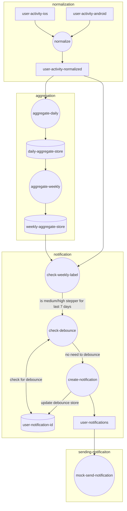

kakafka connect for transformation
timezone challenges
different device - how to reconcile
    - strategy

# Steps Processor
The idea of this project is to aggregate step count for user to label them as low/medium/high daily steppers

Should the user be medium/high for the past 7 days consecutively, it is also trying to send a notification (mock notification)

The service is written using Kafka Streams, combining the DSL as well as Processor API

## Setup
### Prerequisites
- Java 21
- Gradle
- Docker compose
- Node 23 (for producer code)

First start kafka by running docker compose
```
docker compose up -d
```

Once Kafka is running (check with `docker compose logs kafka -f` or go to Kafka UI at http://localhost:8080) then initialise the topics

```
./init-topic.sh
```

### Logging
Log level is set to "DEBUG" by default, you can use "TRACE" if you want to have a lot more details. This can be set at 
`src/main/resources/logback.xml` and `src/test/resources/logback-test.xml` respectively

### Run
Once topics are created, you can then run the Kafka Streams application using Gradle

```
./gradlew run
```

In another terminal session, you can start generating incoming data, go to `producers/` directory 

```
node producer.js MEDIUM 1
```

This will generate traffic for 1 user that is always medium daily steps. Every second it will shift the timestamp by 1 hour and eventually by the end of the day it will always be medium count of steps

There are also options to do HIGH or LOW or LOW_TO_HIGH

As we get more data, you can see if the user has consistently be a medium/high daily stepper for 7 days, if the user is, then "SEND NOTIFICATION" will be logged in terminal


### Test
To run test

```
./gradlew test
```

## High level diagram


Why this approach

Why notification as separate topic

Processor vs DSL
