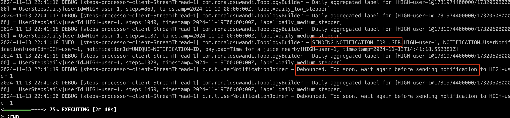
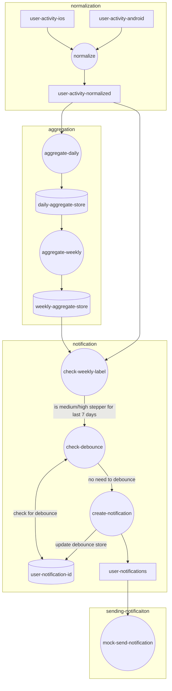

kakafka connect for transformation
timezone challenges
different device - how to reconcile
    - strategy

# Steps Processor
A streaming application that aggregate step count for user to label them as low/medium/high daily steppers

Should the user be medium/high for the past 7 days consecutively, it is also trying to send a notification (mock notification)

The service is written using Kafka Streams, combining the DSL as well as Processor API

## Setup
### Prerequisites
- Java 21
- Gradle
- Docker compose
- Node 23 (for producer code)

First start kafka by running docker compose
```
docker compose up -d
```

Once Kafka is running (check with `docker compose logs kafka -f` or go to Kafka UI at http://localhost:8080) then initialise the topics

```
./init-topic.sh
```

### Logging
Log level is set to "DEBUG" by default, you can use "TRACE" if you want to have a lot more details. This can be set at 
`src/main/resources/logback.xml` and `src/test/resources/logback-test.xml` respectively

### Run
Once topics are created, you can then run the Kafka Streams application using Gradle

```
./gradlew run
```

In another terminal session, you can start generating incoming data, go to `producers/` directory 

```
node producer.js MEDIUM 1
```

This will generate traffic for 1 user that is always medium daily steps. Every second it will shift the timestamp by 1 hour and eventually by the end of the day it will always be medium count of steps

There are also options to do HIGH or LOW or LOW_TO_HIGH

As we get more data, you can see if the user has consistently be a medium/high daily stepper for 7 days, if the user is, then "SEND NOTIFICATION" will be logged in terminal



### Test
To run test

```
./gradlew test
```

## Architecture & Decisions
### Overview
High level diagram of the system below



The system is split into 4 main tasks
1. data normalization
2. steps aggregation
3. notification creation
4. notification handler

### Tasks
By splitting the system into 4 main tasks, we can then extract it to a separate service should it be required but 
for the purpose of this project, having them in a single Kafka Streams app would suffice

#### Data normalization
This simply listen to both incoming data for Android and iOS, normalize them into `user-activity-normalized` topic 
for further processing

#### Steps aggregation
Next is to perform aggregation on the steps count, this is implemented using Kafka Stream's Windowing (tumbling window) 
of 1 day with grace period of 1 hour - so if there is data that come late, there is additional 1 window gap where it 
can still be counted in the day window

The aggregation uses custom timestamp extractor because we want to use the steps timestamp as the timestamp information 
and not producer/event time

Data is then stored into KTable for a quick lookup as well as State Store should it needs to restore from disk in case 
of failure

Next is to process this daily aggregated steps into weekly information. This is where I have to use Processor API 
because it is not achievable simply through using Kafka Streams DSL without a lot of intermediary steps

The Processor then groups the daily steps per user, store them for 7 days and then check for steps counts for all of 
the 7 days. It then has these 3 checks:
1. If there is not enough data (daily steps hasn't reach 7 days yet) - we simply forward the request with empty label
2. If the steps data are all continuous (in this case, the timestamp differences are all 1 days). If this is not the 
   case, there is a gap (user went offline for few days), so we simply forward the request with empty label as well
3. If all of them are "medium" or "high", then we forward the request with "medium_or_high" label
4. Otherwise, we forward the request with "low" label

The weekly aggregation output is stored in `user-steps-7-days-aggregated` topic where the key-value will be 
`<user_id, 7_days_aggregated_label>` (ie. `<user1, medium_or_high>, <user2, low>`). For this topic, the cleanup policy 
compaction since it will be used for lookups

#### Notification creation
Simultaneously, this system also listen to `user-activity-normalized` as new steps data coming in. It then perform 
first join with weekly label; a KTable created from `user-steps-7-days-aggregated` in the prior steps. If the join is 
successful AND the user label is "medium_or_high" we then proceed to the next step

Next we do left join with `user-notification-id` KTable. This act as a debouncer, so if the user already exists in the 
user notification id table, it will check the notification timestamp. If current timestamp-notification timestamp is 
greather than the limit (currently this is hard coded to **10 SECONDS** to make it easy for testing), then we can 
proceed to create notification, otherwise we simply ignore this so that user doesn't receive too many notifications

Notification is then created with a unique notification id (currently it's only hardcoded dummy string)

#### Notification handling
This listens to `user-notifications` topic, and will then proceed with actual notification handling - simply a 
logging at the moment

Unique notification ID is needed so that in a scenario where we actually send notification to 3rd party service 
(Apple APNS/Firebase/Email), the unique ID will be used by the 3rd party service to prevent duplicate notifications 
being sent. This is to handle a scenario where notification-handling service went down after sending request to 3rd 
party but haven't commit the consumer offset and restarted


## Limitations and further improvements
### No checking on location
Currently notification simply checks for the weekly aggregation, it doesn't perform additional check on pincode/lat/long

This is something that can be added in the future

### Potential stale data
In a corner case where during 7 days user has always been medium stepper but on current day user is still low. And the 
incoming steps count comes in and user is now at medium stepper, notification will not be sent because the table hasn't 
been updated. This is because notification creation and steps aggregation are both running in parallel

Because generally this kind of system expects a continuous data stream, typically this will not be an issue

One way to prevent this is to combine Steps Aggregation and Notification Creation into 1 subtask but this will make the 
system more tightly coupled

### Timezone
This assumes the whole system operate in a single timezone. If there is a need for handling different timezone or user 
switching timezone (traveling), we'll need to update the aggregation to handle that (update timestamp extractor, and 
handle edge cases)

### Others
Other limitations/improvements that can be added
- Extracting config into separate files
- Add more thorough logging/metrics

