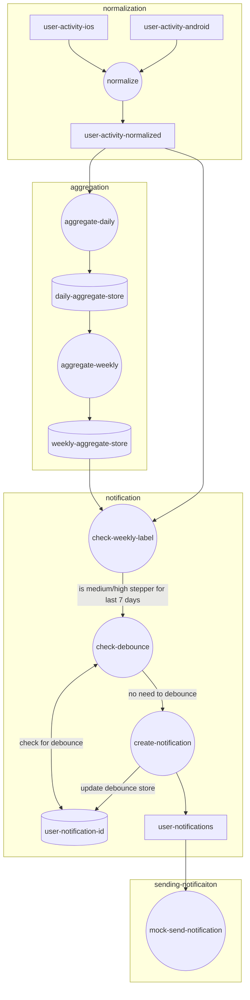

# Steps Processor
## Overview
The Steps Processor is a streaming application that aggregates daily step counts per user to classify them as low, 
medium, or high daily steppers. When a user has consistently been a medium/high stepper over the past 7 days, the 
system generates a mock notification. This project demonstrates Kafka Streams, utilizing both the DSL and Processor 
APIs for flexible stream processing. 

## Architecture & Key Design Decisions

The architecture is divided into four main tasks to ensure modularity and adaptability:

1. Data Normalization: Normalizes data from different sources (Android/iOS) into a unified format.
2. Steps Aggregation: Aggregates daily and weekly step counts, classifying users based on their activity.
3. Notification Creation: Checks for conditions to trigger notifications and handles deduplication.
4. Notification Handling: Mock processing of notifications, representing a connection to an external service.

This modular approach allows future extraction of each task as a standalone service if necessary. Currently, all 
tasks run within a single Kafka Streams application to keep the setup straightforward.

### High Level Flow Diagram



## Setup
### Prerequisites
- Java 21
- Gradle
- Docker compose
- Node 23 (for the data producer)

### Initial Setup
Start Kafka by running Docker Compose:
```
docker compose up -d
```

Once Kafka is running (you can confirm with docker compose logs kafka -f or check the Kafka UI at 
http://localhost:8080), initialize the topics:

```
./init-topic.sh
```

### Running the Application
Run the Kafka Streams Application: Start the main application using Gradle.
```
./gradlew run
```

Generate Sample Data: In another terminal, navigate to the producers/ directory and run:
```
node producer.js MEDIUM 1
```

This generates traffic for a single user with medium daily steps, simulating hourly step count data. You can 
specify HIGH, LOW, or LOW_TO_HIGH for different step count scenarios.

As data accumulates, the application will log a "SEND NOTIFICATION" message if a user consistently qualifies 
as a medium/high stepper for 7 consecutive days.


### Testing
Run tests using Gradle:

```
./gradlew test
```

The tests cover various scenarios across the normalization, aggregation, and notification stages.

## Detailed Breakdown of Each Task
### Data Normalization
The application listens to incoming data from Android and iOS sources, normalizing them into the 
`user-activity-normalized` topic for further processing.

### Steps Aggregation
This task aggregates daily step counts using Kafka Streams' tumbling windows (1 day with a 1-hour grace period). 
A custom timestamp extractor ensures we use the correct timestamp field. The daily aggregates are stored in a KTable 
and are used to build weekly aggregations. Weekly aggregation employs the Processor API to store and evaluate daily 
step data over a 7-day period.

The weekly processor checks for:
- Continuity of data over the 7-day window
- Consistency in medium/high step counts to ensure that user has no missing gap (ie. offline for a few days)
- Outputs a label (medium_or_high or low) based on these checks.

### Notification Creation
The application continuously monitors `user-activity-normalized` for new step data. When new data arrives, it joins with 
the weekly label data in `user-steps-7-days-aggregated` to determine if the user qualifies as a "medium_or_high" 
stepper. A secondary left join with `user-notification-id` implements a debounce mechanism to prevent redundant 
notifications: if a user was recently notified (within the last **10 seconds** - this is hardcoded for now), no new 
notification is created. If all conditions are met, a notification message is sent to the downstream topic 
`user-notifications`.

### Notification Handling
This task processes the `user-notifications` topic, simulating sending notifications. In a real-world system, the 
unique notification ID would prevent duplicate notifications and integrate with third-party services.

## Limitations and Future Improvements
### Location-Based Notifications
Currently, notifications are based only on step counts, with no additional checks for location. 
Future implementations could add location-based filtering.

## Potential Stale Data
The parallel processing of steps aggregation and notification creation can lead to potential stale data if a user 
qualifies as a medium stepper but doesn’t immediately trigger a notification. This can be addressed by combining the 
two tasks into one, though it would increase coupling.

## Timezone Handling
The system currently operates in a single timezone. Handling users traveling across timezones would require 
adjustments to the timestamp extractor and could add complexity to the aggregation logic.

## Additional Improvements
- Configurable Debouncing Timeouts: To make the system more robust.
- Externalized Configuration: For easier management of settings.
- Enhanced Logging and Metrics: To improve observability and performance monitoring.
